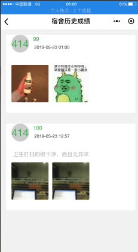

# 	 SSM小程序


dbteam是后端代码 first是小程序代码


前端用微信小程序搭建，后端主要用到了目前开发常用的SSM框架(Spring+Spring+Mybatis)

首先阐述一下我们为什么要编写一款关于检查卫生的小程序

我以前是系里生卫部的成员，我们在检查卫生的时候是用笔记在本子上，在有的宿舍有很多条的时候写起来很

麻烦，而且还要每个宿舍对打扫不合格的地方用手机拍下来，图片分辨宿舍的时候需要用QQ画笔一个一个宿舍

写上去，而且辅导员老师也不利于实时关注宿舍卫生情况，很麻烦 就像下面这样


而这个小程序就可以替代这些功能大大节省检查卫生人员的时间

我现在的权限是管理员 不是超级管理员所以只能展示管理员的功能

1，个人界面


2，提交宿舍检查卫生的情况


3，对宿舍卫生情况进行查询，可以显示最近的检查和历史数据



我们以60分为标准 低于六十分文字变红


如果数据添加错误可以对数据进行修改


对所有卫生成绩进行查询（只显示最近查询的的一次，若看历史数据点开宿舍就可以看到）


代码结构目录


由于考虑的以后可能会出现大量的查询请求我们开启了Mybatis的二级缓存（虽然有一定的缺陷但是用在这里还是可以的）

​	

```xml
<settings>
	<setting name="cacheEnable" value="true" />
</settings>

<!-- 在mapper.xml 中设置开启-->
<cache eviction="LRU" ></cache>


并在java pojo中实现序列化接口
public class noticBar implements Serializable{

```


在一个就是应对大量的数据连接我们用C3P0 数据库连接池来管理

```xml
<context:property-placeholder location="classpath:dbconfig.properties" />
	<bean id="pooledDataSource" class="com.mchange.v2.c3p0.ComboPooledDataSource">
		<property name="jdbcUrl" value="${jdbc.jdbcUrl}"></property>
		<property name="driverClass" value="${jdbc.driverClass}"></property>
		<property name="user" value="${jdbc.user}"></property>
		<property name="password" value="${jdbc.password}"></property>
		<!--当连接池中的连接耗尽的时候c3p0一次同时获取的连接数。Default: 3 --> 
        <property name="acquireIncrement">
            <value>${c3p0.acquireIncrement}</value>
        </property>
        <!--初始化时获取三个连接，取值应在minPoolSize与maxPoolSize之间。Default: 3 --> 
        <property name="initialPoolSize">
            <value>${c3p0.initialPoolSize}</value>
        </property>
        <property name="minPoolSize">
            <value>${c3p0.minPoolSize}</value>
        </property>
        <property name="maxPoolSize">
            <value>${c3p0.maxPoolSize}</value>
        </property>
        <!--最大空闲时间,60秒内未使用则连接被丢弃。若为0则永不丢弃。Default: 0 --> 
        <property name="maxIdleTime">
            <value>${c3p0.maxIdleTime}</value>
        </property>
        <!--每60秒检查所有连接池中的空闲连接。Default: 0 --> 
        <property name="idleConnectionTestPeriod">
            <value>${c3p0.idleConnectionTestPeriod}</value>
        </property>

	
	</bean>
```


为了方便我们参数从perpropties文件引入


还有一个问题就是数据校验 引入JSR303数据校验（未前端进行交互）

```java
@Size(min=100,max=701,message="{Swb.hostelId.length.error}")
	public int hostelId;//宿舍号
```


由于我们前端数据发送过来的时候 调用同一个方法会造成并发问题


我们在方法上加一个锁 关键字 **synchronized** 让这个方法每次只能一个线程访问，当然这情况会消耗一些服务器的性能

```java
@ResponseBody
	@RequestMapping(value = "/add")
	public synchronized Map<String, Object> addS(HttpServletRequest request,
			
			@RequestParam(value = "file", required = false) MultipartFile file,
			@RequestParam(value = "swb", required = false) Swb swb
	
	) throws IllegalStateException, IOException {
```


再者项目要发布到服务器 有些错误需要记录下来 还有为了防止检查人员徇私舞弊我们对敏感操作添加了log4j日志，进行记录

```properties
log4j.appender.logfile.File =/usr/***/log4j.log
#日志的最大容量为10M
#log4j.appender.logfile.maxFileSize=10240KB 
#是否追加写进文件    
log4j.appender.logfile.Append = true   
#输出DEBUG级别日志到文件中 
log4j.appender.logfile.Threshold = DEBUG    
log4j.appender.logfile.layout = org.apache.log4j.PatternLayout
log4j.appender.logfile.layout.ConversionPattern = %d [%t] %-5p %c - %m%n

```

在程序发布的时候我们就是靠着查看Linux上我们配置的日志文件解决了一个又一个Bug


代码逻辑


在配置文件中对Spring事务 的get方法进行增强

```xml
<bean id="transactionManager" class="org.springframework.jdbc.datasource.DataSourceTransactionManager">
		<!--控制住数据源  -->
		<property name="dataSource" ref="pooledDataSource"></property>
	</bean>
	<!--开启基于注解的事务，使用xml配置形式的事务（必要主要的都是使用配置式）  -->
	<aop:config>
		<!-- 切入点表达式 -->
		<aop:pointcut expression="execution(* com.dbteam.serviceIml..*(..))" id="txPoint"/>
		<!-- 配置事务增强 -->
		<aop:advisor advice-ref="txAdvice" pointcut-ref="txPoint"/>
	</aop:config>
	
	<!--配置事务增强，事务如何切入  -->
	<tx:advice id="txAdvice" transaction-manager="transactionManager">
		<tx:attributes>
			<!-- 所有方法都是事务方法 -->
			<tx:method name="*"/>
			<!--以get开始的所有方法  优化 事物增强-->
			<tx:method name="get*" read-only="true"/>
		</tx:attributes>
	</tx:advice>
```


建表语句


不足：

1，还是没有解决高并发问题，对高并发知识点掌握薄弱，

2，没有引用其他第三方缓存，而是用Mybatis自带的二级缓存，

3，对代码优化比较少，

4，代码结构有点混乱，有冗余的地方


